# Layanan Pengaduan Jaringan 🌐

Sistem Informasi Layanan Pengaduan Jaringan (Helpdesk Jaringan) berbasis web yang dikembangkan menggunakan framework Django (Python). Aplikasi ini bertujuan untuk memudahkan pelaporan, penanganan, dan pemantauan kendala jaringan yang terjadi di berbagai bidang/departemen.

## 🚀 Fitur Utama

- **Manajemen Pengaduan (Tiket):** Pelaporan kendala jaringan dengan kategori, deskripsi detail, lampiran, dan prioritas.
- **Role-Based Access Control (RBAC):** Hak akses yang dibedakan untuk 3 peran utama (Admin, Teknisi, dan Pelapor).
- **Tracking Status Laporan:** Memantau status laporan (Menunggu, Diproses, Selesai).
- **Service Level Agreement (SLA):** Peringatan otomatis jika laporan belum ditangani dalam waktu 24 jam.
- **Sistem Rating & Ulasan:** Pelapor dapat memberikan penilaian dan ulasan terhadap kinerja teknisi setelah laporan selesai.
- **Manajemen Pengguna:** Admin dapat mengelola akun pengguna, mengatur bidang/departemen, dan menambahkan akun teknisi.
- **Dashboard Informatif:** Dashboard yang disesuaikan untuk masing-masing peran pengguna.

## 👥 Peran Pengguna (Roles)

1. **Pelapor (User/Pegawai)**
   - Membuat laporan pengaduan jaringan baru.
   - Melampirkan bukti kendala (foto/dokumen).
   - Melihat status laporan yang telah dibuat.
   - Memberikan rating dan ulasan pada laporan yang telah diselesaikan.

2. **Teknisi**
   - Menerima dan menangani laporan pengaduan yang ditugaskan.
   - Memperbarui status laporan (Menunggu -> Diproses -> Selesai).
   - Mengunggah bukti penyelesaian dan memberikan solusi yang dilakukan.

3. **Admin**
   - Memantau seluruh laporan pengaduan yang masuk.
   - Mengelola akun teknisi dan pelapor.
   - Mengelola data Bidang / Departemen.
   - Melihat ringkasan dan detail setiap laporan di sistem.

## 🛠️ Teknologi yang Digunakan

- **Backend:** Python, Django
- **Frontend:** HTML, CSS, JavaScript (Template Engine Django)
- **Database:** SQLite (Bawaan Django, dapat disesuaikan ke PostgreSQL/MySQL)

## 📸 Screenshot Antarmuka (UI)

### 👨‍💼 Halaman Pelapor
<details>
<summary>Lihat Screenshot Pelapor</summary>

- **Login Pelapor**
<br> 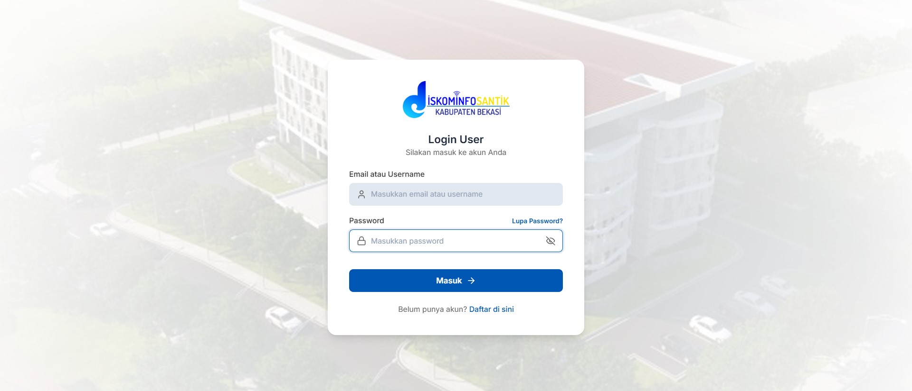
- **Dashboard Pelapor**
<br> 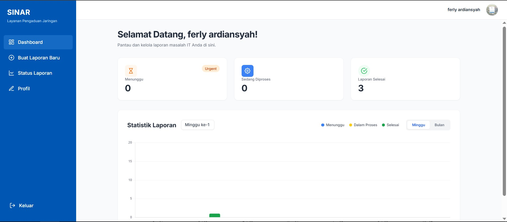
- **Buat Laporan**
<br> 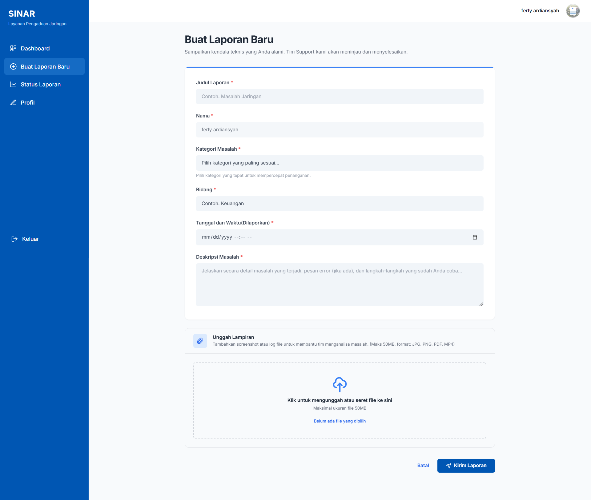
- **Daftar Laporan**
<br> 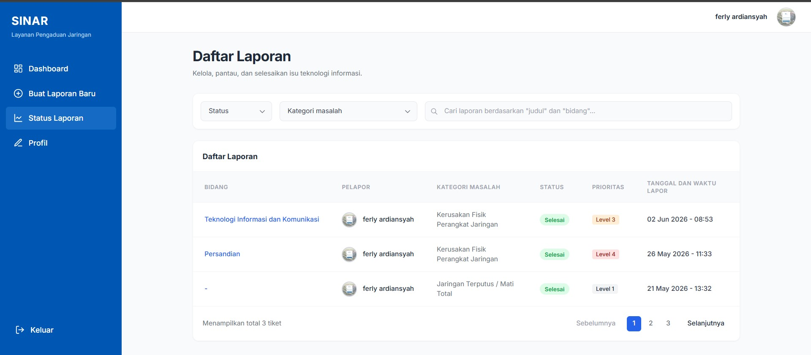
- **Detail Laporan**
<br> 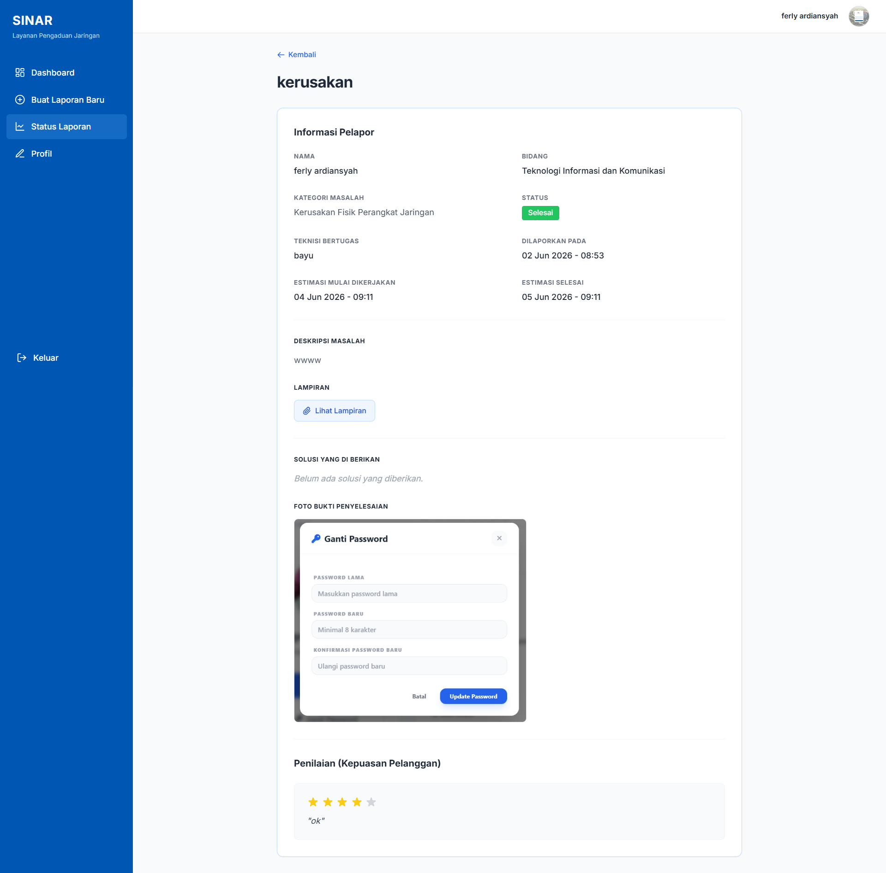
- **Profil Pelapor**
<br> 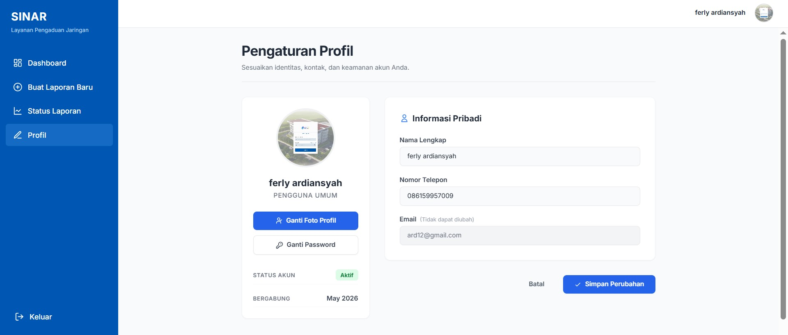
</details>

### 🔧 Halaman Teknisi
<details>
<summary>Lihat Screenshot Teknisi</summary>

- **Login Teknisi**
<br> 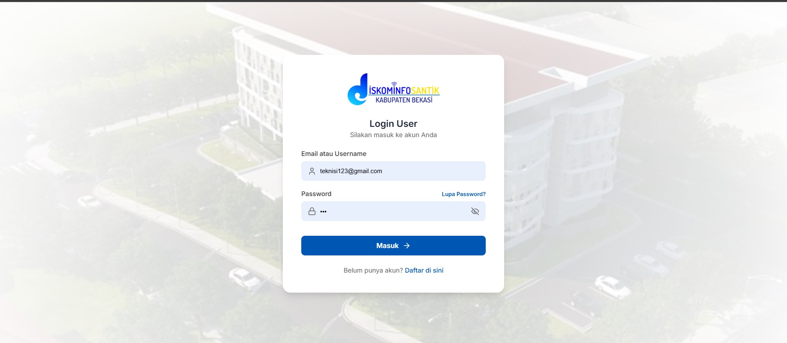
- **Dashboard Teknisi**
<br> 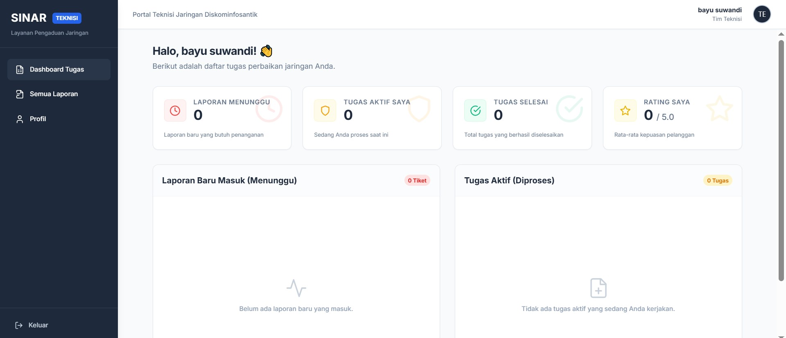
- **Daftar Laporan Tugas**
<br> 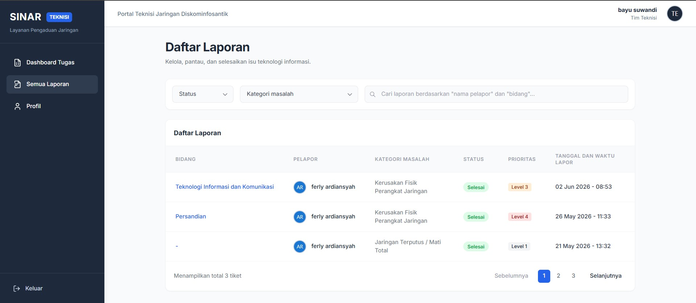
- **Detail & Penanganan Laporan**
<br> 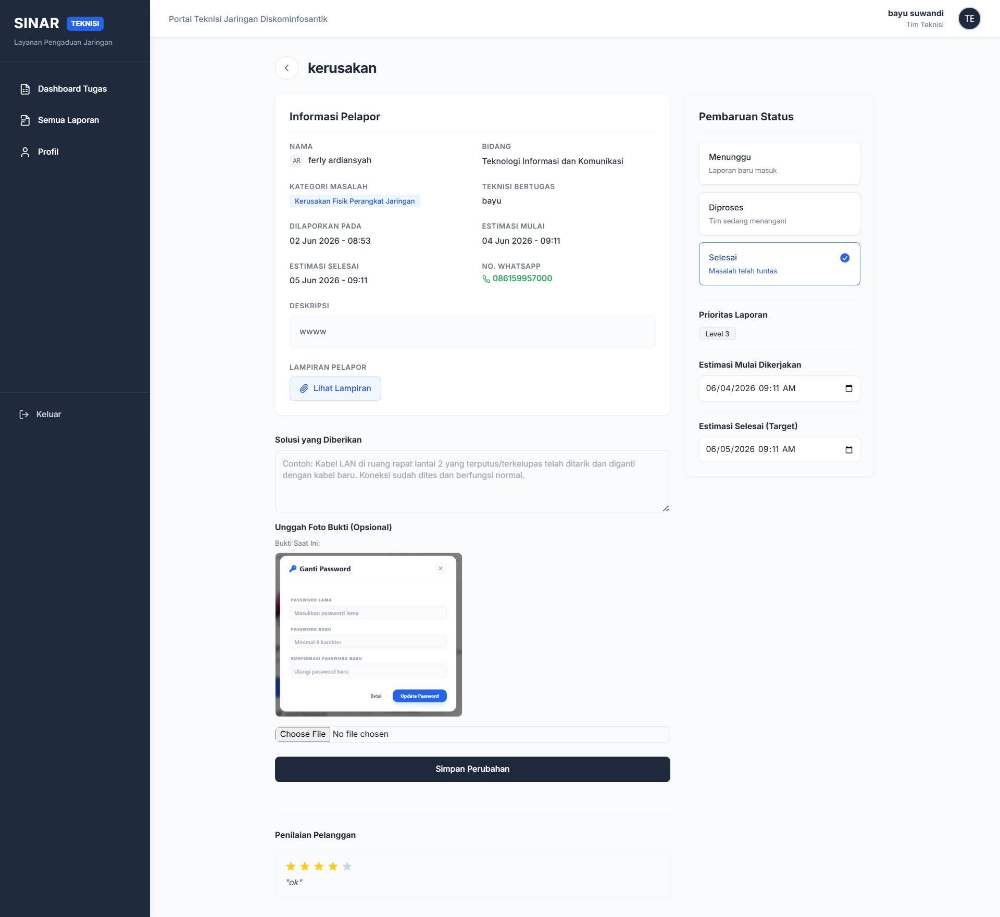
- **Profil Teknisi**
<br> 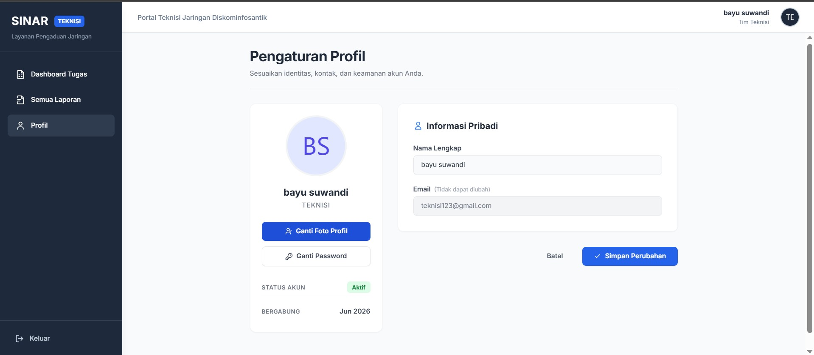
</details>

### 👑 Halaman Admin
<details>
<summary>Lihat Screenshot Admin</summary>

- **Login Admin**
<br> 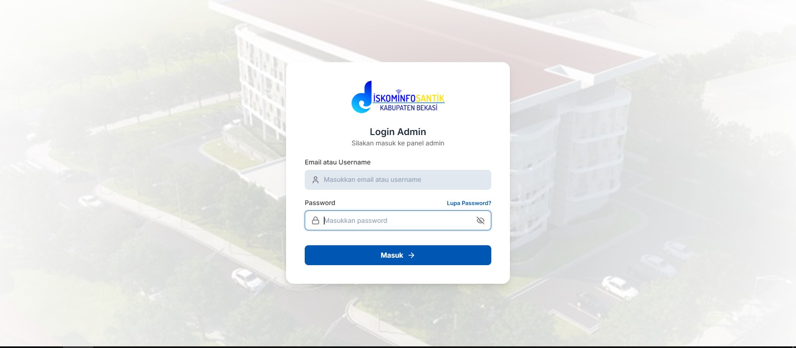
- **Dashboard Admin**
<br> 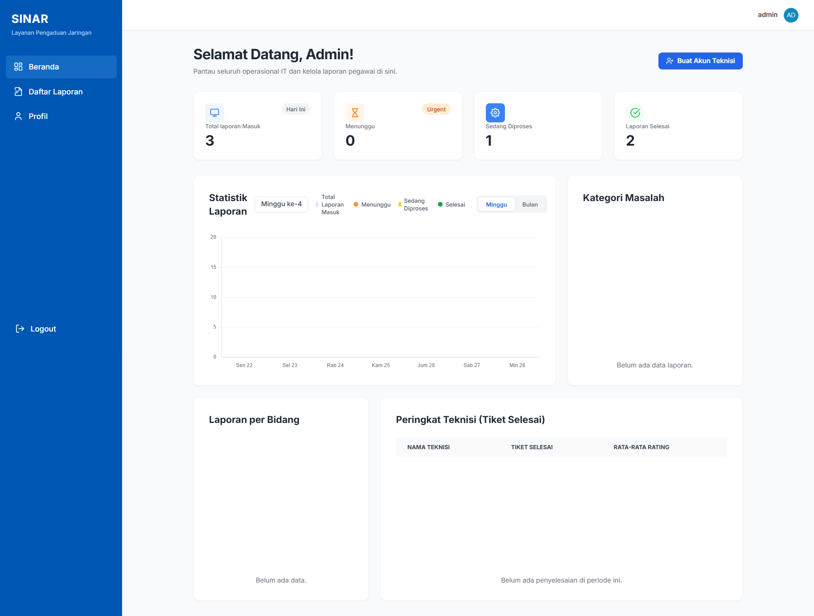
- **Daftar Seluruh Laporan**
<br> 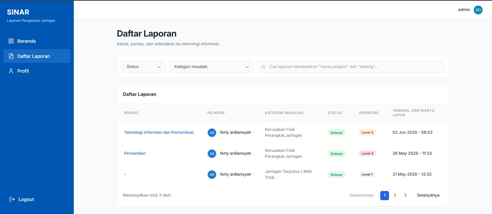
- **Detail Laporan (Pantauan Admin)**
<br> 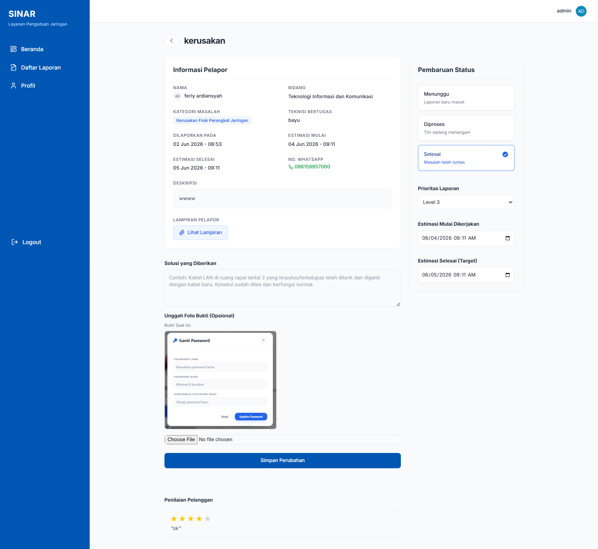
- **Buat Akun Teknisi**
<br> 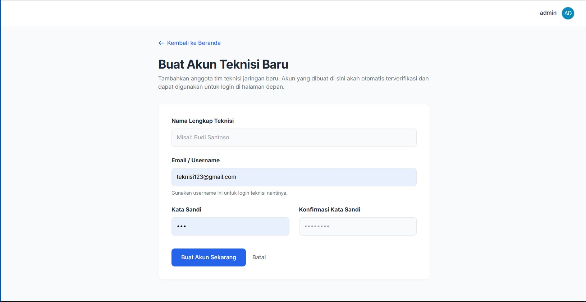
- **Profil Admin**
<br> 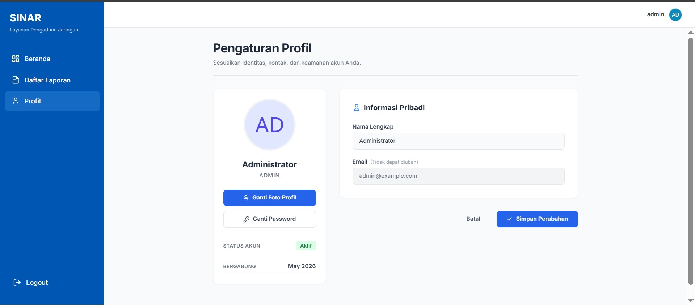
</details>

## ⚙️ Panduan Instalasi (Menjalankan secara Lokal)

1. **Clone Repository**
   ```bash
   git clone https://github.com/Ferly02/layananpengaduanjaringan.git
   cd layananpengaduanjaringan
   ```

2. **Buat dan Aktifkan Virtual Environment (Opsional namun disarankan)**
   ```bash
   python -m venv venv
   # Di Windows
   venv\Scripts\activate
   # Di Linux/Mac
   source venv/bin/activate
   ```

3. **Install Dependencies**
   (Pastikan terdapat `requirements.txt`, jika tidak, install Django)
   ```bash
   pip install django
   ```

4. **Jalankan Migrasi Database**
   ```bash
   python manage.py makemigrations
   python manage.py migrate
   ```

5. **Buat Superuser (Admin) / Seed Data**
   ```bash
   python create_admin.py  # Jika Anda memiliki script ini
   # Atau
   python manage.py createsuperuser
   ```

6. **Jalankan Development Server**
   ```bash
   python manage.py runserver
   ```
   Aplikasi dapat diakses melalui browser di `http://127.0.0.1:8000/`.

---
**Repository:** [https://github.com/Ferly02/layananpengaduanjaringan.git](https://github.com/Ferly02/layananpengaduanjaringan.git)
